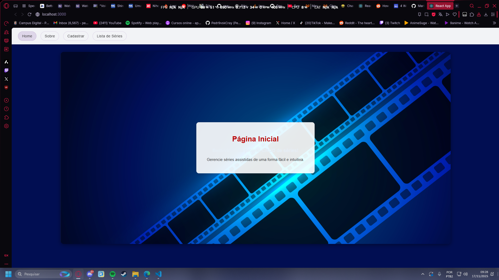
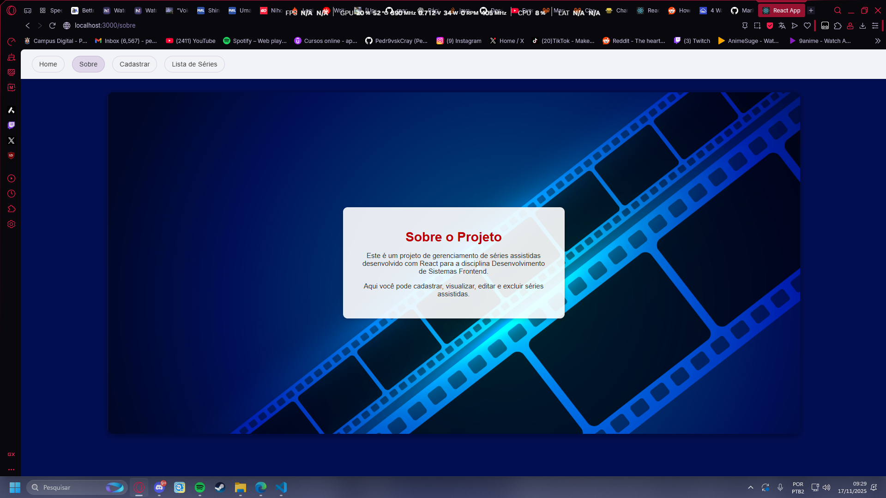
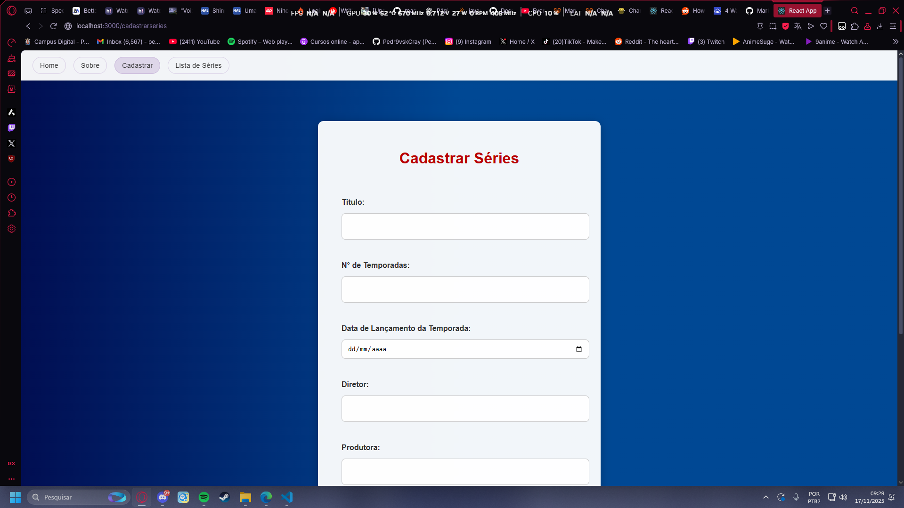
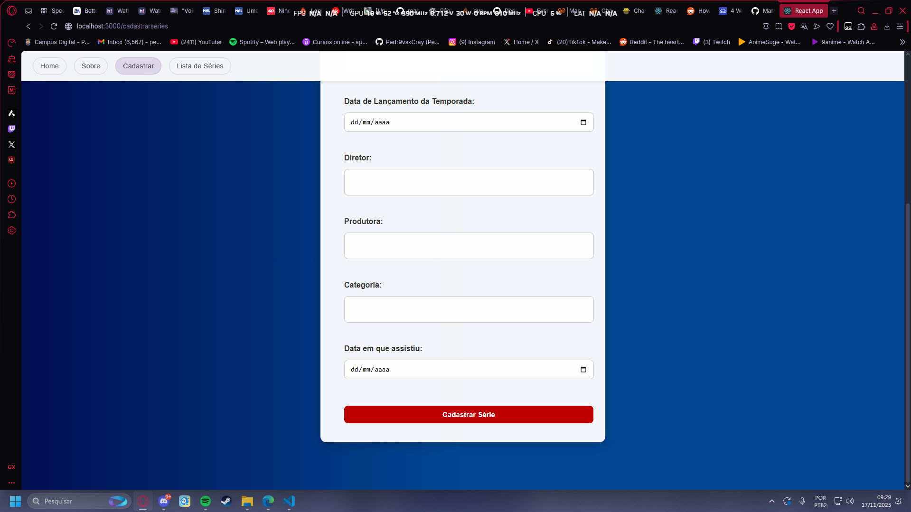
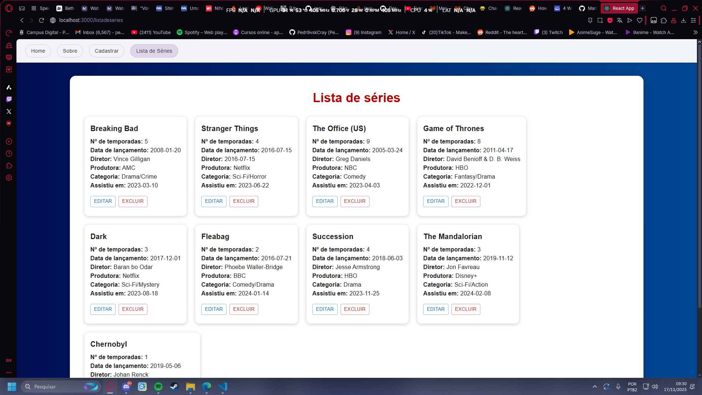
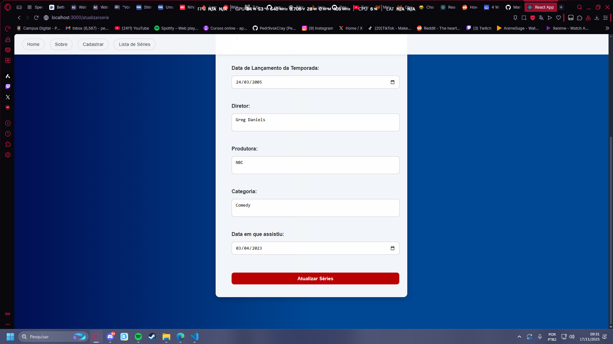

# Projeto Fase 2 - PUCRS Online

Esse projeto foi feito utilizando React [Create React App]

## Comandos Disponíveis

In the project directory, you can run:

### `npm start`

Para executar o projeto em modo de desenvolvimento
Abra [http://localhost:3000](http://localhost:3000) para visualizar em seu navegador

### `npm test`

Para lançar o ambiente de teste no modo interativo

### `npm run build`

Para buildar o projeto na pasta "./build"

### `npm install`

Para instalar todas as dependências

## Dependências utilizadas

- react
- react-router-dom
- axios
- @testing-library/jest-dom
- @mui/material
- @mui/icons-material
- web-vitals

## Componentização

O App é divido em componentes, cada um com sua função e objetivo que estão brevemente descritos abaixo:

### App.js

Reúne todos os componentes para serem executados, também define as rotas que levarão para cada componente

### navBar.js 

É o componente responsável pela barra de navegação, está sempre presente em qualquer página do App, possui botões que redirecionam para outras rotas (outros componentes) que foram definidas no App.js

`A navBar e a sua utilização pode ser vista nas fotos dos outros componentes...`

### home.js

É a página inicial do projeto e serve como introdução para o App

### sobre.js

É a página onde descrevemos a função e objetivo do App

### cadastrar.js

É a página onde cadastramos séries novas utilizando o formulário presente na página

### listarSeries.js

É a página que lista as séries que temos cadastradas em nosso App, possui botões para editar e excluir as séries conforme for desejado

### atualizarSeries.js

É uma página "oculta" que só pode ser acessada ao tentar editar as informações de alguma das séries listadas no componente `listarSeries.js`, é uma versão do componente `cadastrar.js` que vem preenchido automaticamente com as informações da série que o usuário escolheu editar, ao enviar o formulário, as informações da série escolhida são atualizadas e o usuário é automaticamente redirecionado de volta para
`listarSeries.js`

## API

Esse projeto depende também da API `serieJournal-api` que se encontra em [API](https://github.com/adsPucrsOnline/DesenvolvimentoFrontend/tree/main/serieJournal-api)
